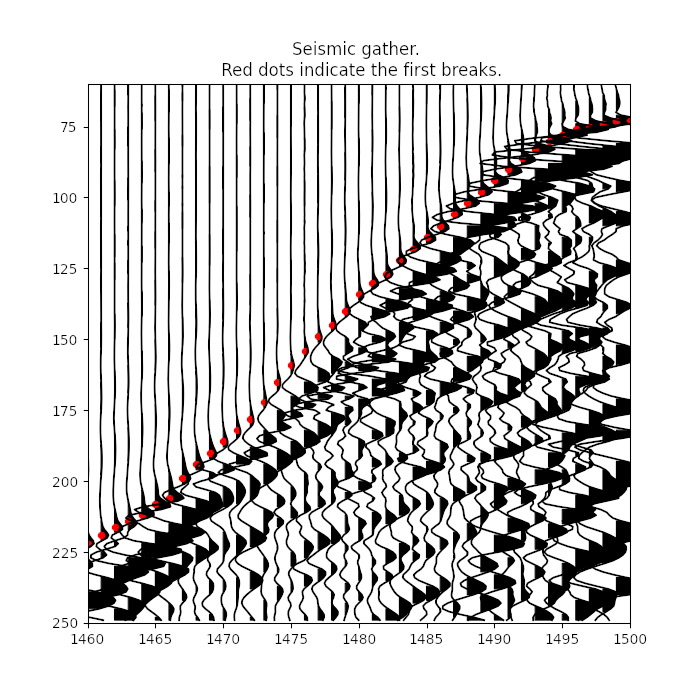

#  First break picking

The objective of First Break Picking is to determine the arrival time of the wave traveling from source to receiver for each seismic trace.



## Data

Before the competition starts participants can examine synthetic SEG-Y file and csv file with the corresponding picking:

- [SEG-Y file with trace data](./data/example_prestack.sgy)
- [csv file with first break times](./data/example_picking.csv)

Details about competition data for different submission types dscribed in [Submission process](#Submission-process) section.
## Submission process

There are two ways to participate in Competition:

### **I. Container submission**
Participants should prepare a docker image with all the necessary software and scripts required for automated first break picking, upload image to a docker registry and submit the link to the image and credentials to pull it via email: [competition@eage-annual-amsterdam.org](mailto:competition@eage-annual-amsterdam.org).

Those containers will operate on an `autotest.sgy` file, which will not be published.

* #### Examples
	- [Dockerfile](../Dockerfile) - Dockerfile to build an example image.
	- [inference.sh](../inference.sh) - Example of the inference script.

Docker images are going to be run on a server with 64 GB of RAM, 512 GB of storage, and 1 GPU with NVIDIA driver version 470.57.

Example of container execution command:
```bash
    docker run --gpus all \
               -v $(pwd)/competition:/competition \
               -v $(pwd)/imagename_result:/result \
               %imagename%:latest
```

* #### Folder structure:
Participants should assume the following folder structure inside the container:
```
/
├───result
└───competition
    |    autotest.sgy
```

Resulting file with predicted first breaks should be named `submission.csv` and placed in a subdirectory `results`:

```
/
├───result
|   |    submission.csv
└───competition
    |    autotest.sgy
```

* #### Timing

Docker container execution time will be displayed as the timing of the solution.

### **II. File submission**

Those who cannot prepare and submit a container are encouraged to apply their tools to `competition_test.sgy`, which will be available at the start of the competition. Participants should submit link to the resulting csv file with first break times along with credentials needed to download it via email: [competition@eage-annual-amsterdam.org](mailto:competition@eage-annual-amsterdam.org).

Such solutions will not have an *automated* badge on leaderboard and their solutions' worktime will be measured differently.

* #### Timing

Solutions' worktime will be displayed as the time passed from the dataset publication till the file submission.

## Submission file format
In both cases resulting sumission file should contain three columns: the first one corresponding to FieldRecord ids, second - to TraceNumber ids, and the last one should contain predicted first break times for corresponding traces. [Synthetic FPB file](./data/example_picking.csv) can be used as an example.

## Metric

The metric used to calculate the difference between participants' submits and ground truth label is MAE:

,


where fbp<sub>i</sub> is measured in milliseconds and N is the total numer of traces in SEG-Y file.
